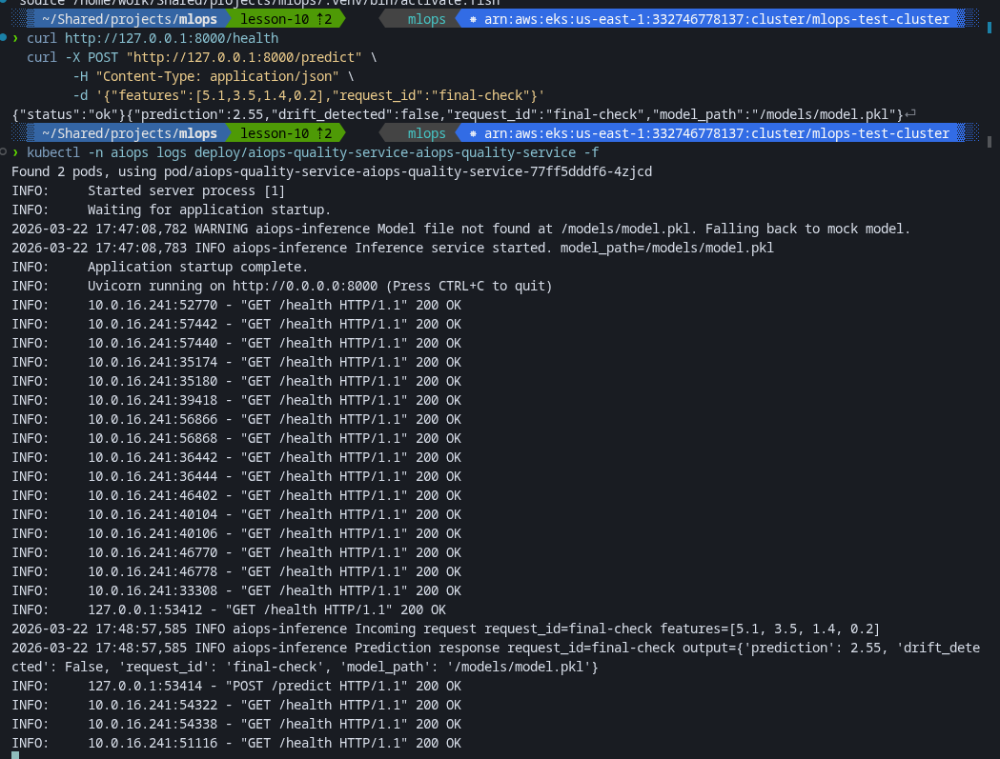
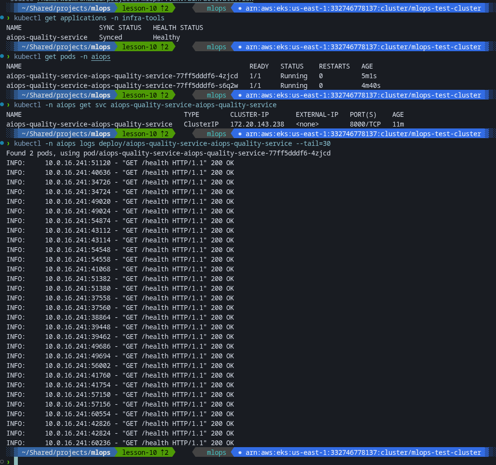
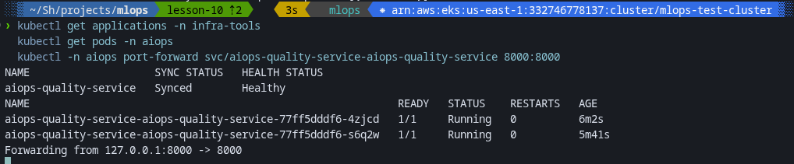
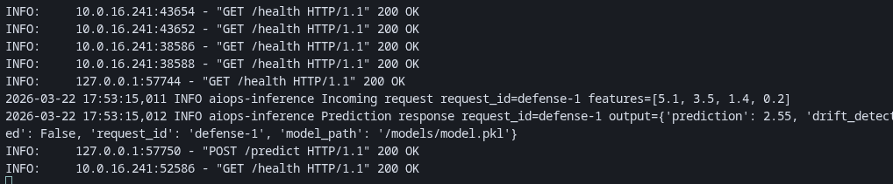
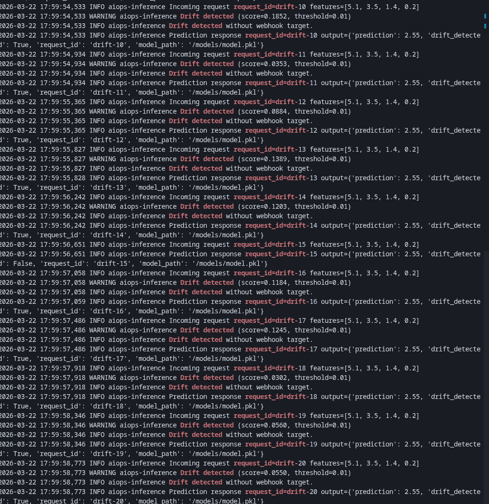
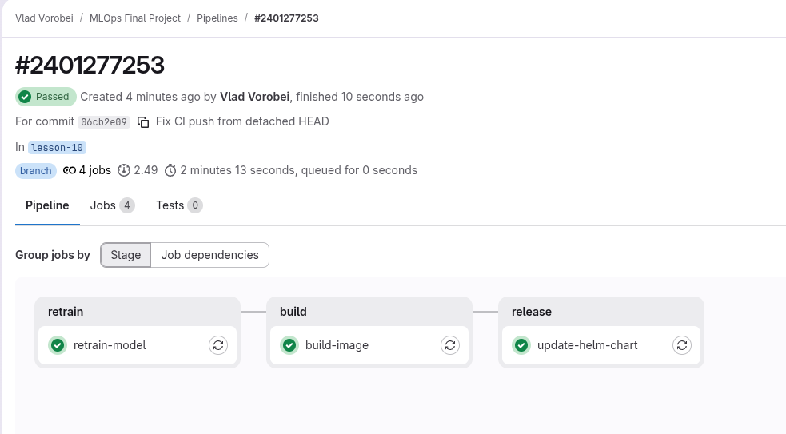

# AIOps Quality Project

FastAPI inference-сервіс з drift detection, GitLab CI retrain pipeline, Helm деплоєм у Kubernetes через ArgoCD, логуванням у Loki та метриками в Prometheus/Grafana.

## Структура проєкту

```text
aiops-quality-project/
├── app/
│   └── main.py
├── model/
│   └── train.py
├── helm/
│   ├── Chart.yaml
│   ├── values.yaml
│   └── templates/
├── argocd/
│   └── application.yaml
├── grafana/
│   └── dashboards.json
├── prometheus/
│   └── additionalScrapeConfigs.yaml
├── loki/
│   └── promtail-config.yaml
├── .gitlab-ci.yml
├── Dockerfile
├── requirements.txt
└── README.md
```

## Компоненти

| Компонент | Призначення |
|---|---|
| FastAPI | Inference API (`/predict`, `/health`, `/metrics`) |
| Helm | Параметризований деплой сервісу в Kubernetes |
| ArgoCD | GitOps sync Helm-чарту з репозиторію |
| Prometheus | Збір метрик сервісу |
| Grafana | Візуалізація requests/latency/drift |
| Loki + Promtail | Збір stdout логів подів |
| GitLab CI | Retrain -> Build -> Helm update |

## Передумови

- Kubernetes кластер з доступом через `kubectl`
- ArgoCD у namespace `infra-tools`
- Docker
- Доступ до GitLab Container Registry
- Python 3.11+

## 1. Локальна підготовка

```bash
cd aiops-quality-project
python -m venv .venv
source .venv/bin/activate
pip install -r requirements.txt
python model/train.py
```

## 2. Збірка і push образу

```bash
export IMAGE_REPO="registry.gitlab.com/vorobei/mlops-final-project/aiops-quality-service"
export IMAGE_TAG="manual-$(date +%Y%m%d%H%M)"
docker build -t "$IMAGE_REPO:$IMAGE_TAG" .
docker push "$IMAGE_REPO:$IMAGE_TAG"
```

Після push оновіть у `helm/values.yaml`:
- `image.repository`
- `image.tag`

## 3. Деплой через ArgoCD

```bash
kubectl apply -f argocd/application.yaml
kubectl get applications -n infra-tools
kubectl get pods -n aiops
```

Очікувано: застосунок `Synced/Healthy`, поди у `Running`.

## 4. Перевірка API

```bash
kubectl -n aiops port-forward svc/aiops-quality-service-aiops-quality-service 8000:8000
```

В іншому терміналі:

```bash
curl http://127.0.0.1:8000/health
curl -X POST "http://127.0.0.1:8000/predict" \
  -H "Content-Type: application/json" \
  -d '{"features":[5.1,3.5,1.4,0.2],"request_id":"final-check"}'
```

## 5. Перевірка логування

```bash
kubectl -n aiops logs deploy/aiops-quality-service-aiops-quality-service -f
```

У логах мають бути:
- вхідні дані запиту;
- prediction response;
- `200 OK`.

## 6. Перевірка drift detector

Для демонстрації зменшіть поріг:

```yaml
env:
  DRIFT_THRESHOLD: "0.01"
```

Потім:
1. Commit + push.
2. Дочекатися sync в ArgoCD.
3. Надіслати серію запитів на `/predict`.
4. Перевірити в логах `Drift detected`.

## 7. Перевірка retrain pipeline (GitLab CI)

Pipeline у `.gitlab-ci.yml`:
- `retrain-model`
- `build-image`
- `update-helm-chart`

Що перевірити:
- модель перестворена;
- образ зібраний і запушений;
- `helm/values.yaml` оновлено новим `image.tag`;
- ArgoCD підтягнув оновлення.

## 8. Як оновити модель

1. Запустити pipeline в GitLab.
2. Дочекатися успішних job.
3. Перевірити новий image tag у Helm values.
4. Перевірити rollout у Kubernetes.
5. Виконати smoke test через `/predict`.

## Результат

- FastAPI-сервіс працює у Kubernetes, задеплоєний через ArgoCD.
- Helm-чарт керує конфігурацією сервісу (image, env, probes, service).
- Логи запитів і відповідей доступні через `kubectl logs`/Loki.
- Drift detection працює і фіксується в логах.
- GitLab CI pipeline retrain/build/release проходить успішно.

## Критерії оцінювання

| Розділ | Опис | Бали |
|---|---|---|
| FastAPI-сервіс | Працює, повертає передбачення, логіка в окремому `predict()` | 15 |
| Helm-чарт | Є налаштування іміджа, порту, environment | 10 |
| ArgoCD | `application.yaml`, auto-sync, self-heal | 10 |
| Логування + Loki | Promtail збирає stdout сервісу | 10 |
| Моніторинг + Grafana | Є дешборд із кількістю запитів, latencies | 10 |
| Drift детектор | Працює у сервісі або окремому контейнері | 15 |
| GitLab CI retrain | Є job, який тригерить retrain -> update -> redeploy | 20 |
| README.md | Повна документація з поясненням архітектури | 10 |
| Загалом |  | 100 |

## Скріншоти







# AIOps Quality Project
