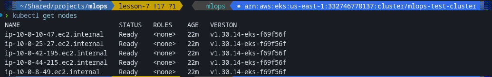
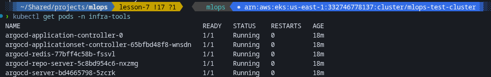
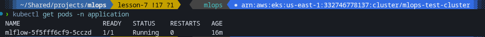
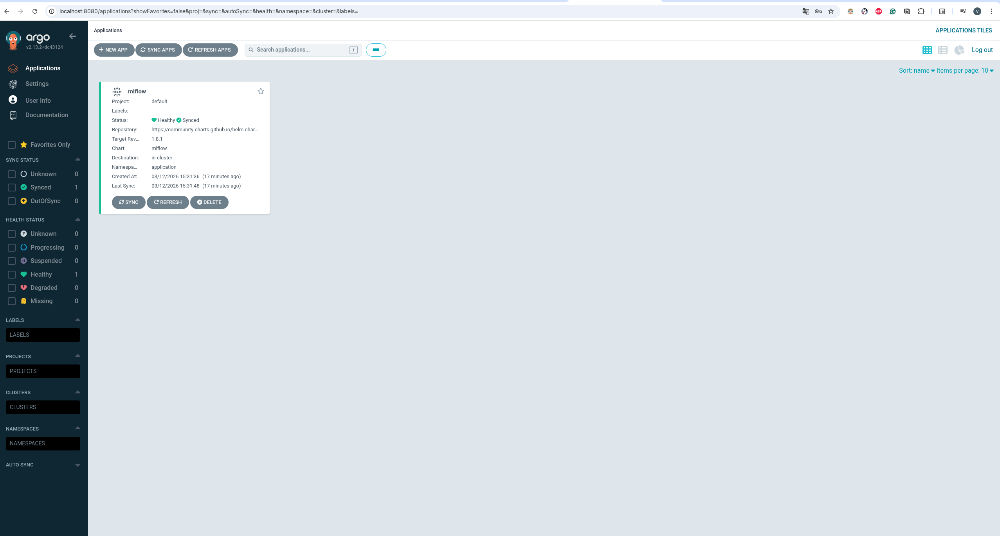
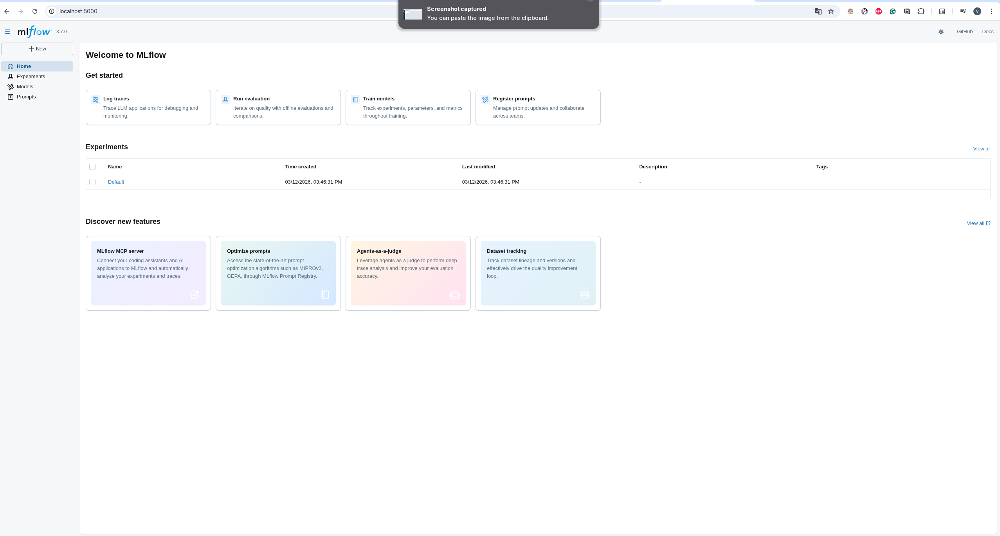

# Terraform: EKS, VPC, ArgoCD

Інфраструктура: VPC та EKS (модульна структура), ArgoCD у EKS як Helm-реліз.

## Структура проєкту

```
terraform/
├── main.tf
├── variables.tf
├── outputs.tf
├── terraform.tf
├── backend.tf
├── terraform.tfvars.example
├── vpc/
│   ├── main.tf
│   ├── variables.tf
│   ├── outputs.tf
│   └── terraform.tf
├── eks/
│   ├── main.tf
│   ├── variables.tf
│   ├── outputs.tf
│   └── terraform.tf
├── argocd/
│   ├── main.tf
│   ├── variables.tf
│   ├── provider.tf
│   ├── outputs.tf
│   ├── terraform.tf
│   ├── backend.tf
│   └── values/
│       └── argocd-values.yaml
└── README.md
```

## Передумови

- AWS CLI налаштований
- Terraform >= 1.3.0
- kubectl
- S3 bucket для backend (параметри в `backend.tf`)

## Змінні та tfvars

Кореневі змінні: `cluster_name`, `region`. Приклад у `terraform.tfvars.example`:

```bash
cp terraform.tfvars.example terraform.tfvars
# Відредагуйте terraform.tfvars (наприклад, cluster_name, region)
terraform plan -var-file=terraform.tfvars
terraform apply -var-file=terraform.tfvars
```

## Порядок деплою

| # | Дія |
|---|-----|
| 0 | goit-argo — окремий Git-репо з application.yaml та namespaces; push на GitHub/GitLab. |
| 1 | VPC + EKS: `cd terraform && terraform init && terraform apply -var-file=terraform.tfvars` |
| 2 | `aws eks update-kubeconfig --name <cluster_name> --region <region>`; `kubectl get nodes` |
| 3 | ArgoCD: `cd terraform/argocd && terraform init && terraform apply -var="cluster_name=<name>" -var="region=<region>"` |
| 4 | У клоні goit-argo: `kubectl apply -f application.yaml` |
| 5 | Перевірка подів, ArgoCD UI, MLflow (port-forward) |

Конфіг: 3 AZ, 4 cpu-ноди + 1 gpu-нода (t3.small). 5 нод після apply.

## 1. VPC + EKS

```bash
cd terraform
terraform init
terraform plan -var-file=terraform.tfvars
terraform apply -var-file=terraform.tfvars
```

```bash
aws eks update-kubeconfig --name <cluster_name> --region <region>
kubectl get nodes
```

## 2. ArgoCD

```bash
cd terraform/argocd
terraform init
terraform apply -var="cluster_name=<cluster_name>" -var="region=<region>"
```

```bash
kubectl get pods -n infra-tools
```

## 3. Application (MLflow) з goit-argo

```bash
cd ~/goit-argo
kubectl apply -f application.yaml
```

```bash
kubectl get applications -n infra-tools
kubectl get pods -n application
```

## 4. UI та доступ

**ArgoCD:** `kubectl port-forward svc/argocd-server -n infra-tools 8080:80`  
Відкрий **http://localhost:8080**. Логін `admin`, пароль:

```bash
kubectl -n infra-tools get secret argocd-initial-admin-secret -o jsonpath="{.data.password}" | base64 -d
```

**MLflow:** `kubectl port-forward svc/mlflow -n application 5000:80`  
Відкрий **http://localhost:5000**.

## Знищення інфраструктури

Спочатку ArgoCD:

```bash
cd terraform/argocd
terraform destroy -var="cluster_name=<cluster_name>" -var="region=<region>"
```

Якщо зависає: `kubectl delete namespace infra-tools --timeout=120s`, потім знову destroy.

Потім EKS і VPC:

```bash
cd terraform
terraform destroy -var-file=terraform.tfvars
```


## goit-argo

Конфігурація ArgoCD Application (MLflow) зберігається в окремому репо **goit-argo**. У репо: `application.yaml`, namespaces (application, infra-tools). Після push потрібно застосувати у кластері: `kubectl apply -f application.yaml` (з клону репо).

## Node groups

- **cpu_nodes** — t3.small, label `workload = cpu-tasks`, desired 4, max 5
- **gpu_nodes** — t3.small, label `workload = gpu-tasks`, desired 1

## Інфраструктура (EKS, ArgoCD, MLflow)

### Скріншоти звіту

**Ноди кластера (EKS):**


**Поди (infra-tools та application):**


**ArgoCD Application (mlflow):**


**ArgoCD UI:**


**MLflow UI:**

